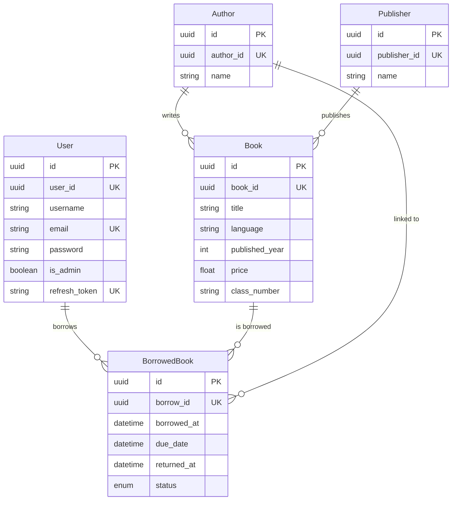
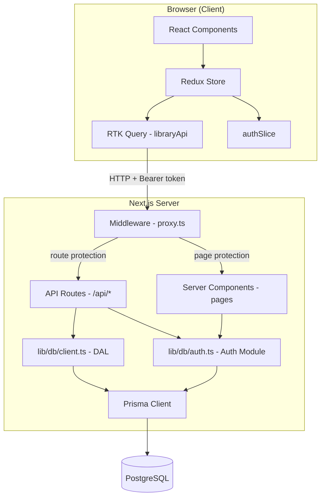

# ISP Library Management System — Project Overview

## Tech Stack

| Layer | Technology |
|---|---|
| **Framework** | Next.js 16 (App Router, React 19) |
| **Language** | TypeScript |
| **Database** | PostgreSQL via Prisma ORM v7 |
| **State Mgmt** | Redux Toolkit + RTK Query |
| **Auth** | Custom JWT (access + refresh tokens) via `jose` + `bcryptjs` |
| **UI** | Tailwind CSS v4, Radix UI (shadcn/ui components), Lucide icons |
| **Data Grid** | AG Grid (Community v35) |
| **Charts** | Recharts |
| **Misc** | `date-fns`, `zod`, `react-hook-form`, `sonner` (toasts), `html-to-image` |

---

## Database Schema (Prisma)



5 models: **User**, **Author**, **Publisher**, **Book**, **BorrowedBook** (with `BorrowStatus` enum: `borrowed`, `returned`, `overdue`).

---

## Architecture Overview



---

## Authentication System

The auth system uses a **dual JWT token** strategy:

| Token | Lifetime | Storage | Purpose |
|---|---|---|---|
| **Access Token** | 30 seconds | Redux store (memory) | Authorize API requests via `Bearer` header |
| **Refresh Token** | 30 minutes | `httpOnly` cookie + DB column | Silently rotate access tokens |

### Flow
1. **Login/Signup** → server generates both tokens, stores refresh in DB & cookie, returns access token to client
2. **API Requests** → client attaches access token as `Bearer` header via RTK Query `prepareHeaders`
3. **Token Expiry** → on `401`, `baseQueryWithReauth` automatically calls `/api/auth/refresh`, deduplicating concurrent refresh attempts via a module-level promise
4. **Logout** → clears cookie, nullifies refresh token in DB, resets Redux state

### Middleware (`proxy.ts`)
- Verifies access token from `Authorization` header and refresh token from cookie
- Builds an `effectiveUser` from either token for page-level auth
- **Protected routes**: `/my-books`, `/books`, `/analytics`, `/authors` → redirect to login
- **Admin routes**: `/admin/*` → redirect non-admins to home
- **API protection**: blocks unauthenticated calls (except public auth endpoints), blocks non-admin from `/api/users`

---

## Data Access Layer ([client.ts](file:///Users/macbookair/Documents/web/library-management-system/lib/db/client.ts))

A clean DAL that wraps all Prisma queries and maps DB models to frontend types:

- **Books**: `getBooks()`, `getBook(id)`, `getBooksByAuthorId(authorId)`
- **Authors**: `getAuthors()`, `getAuthorById(id)`
- **Users**: `getUserByEmail()`, `getAllUsers()`, `getUserByUserId()`, `getUserById()`, `createUser()`, `updateUserPassword()`
- **Borrowing**: `getAllBorrowRecords()`, `getBorrowedBooksByUserId()`, `getAllBooksByStatus()`, `checkBookBorrowedByUser()`, `createBorrowRecord()`, `updateBorrowRecord()`

---

## RTK Query API ([libraryApi.ts](file:///Users/macbookair/Documents/web/library-management-system/lib/redux/services/libraryApi.ts))

17 endpoints organized by domain:

| Domain | Endpoints |
|---|---|
| **Books** | `getBooks`, `getBookById`, `getAuthors`, `getAuthorById`, `getBooksByAuthorId` |
| **Borrowing** | `borrowBook`, `returnBook`, `getBorrowedBooksByUserId`, `getAllBorrowRecords`, `getAllBooksByStatus`, `checkBookBorrowed` |
| **Auth** | `login`, `signUp`, `logout`, `refresh` |
| **Users** | `getAllUsers`, `getUserById` |

> [!TIP]
> `returnBook` uses **optimistic updates** — the UI updates immediately and rolls back on failure.

Cache tags: `Book`, `BorrowedBook`, `User` — automatic invalidation on mutations.

---

## API Routes (17 route handlers)

```
/api/auth/login          POST    Public
/api/auth/signup         POST    Public
/api/auth/logout         POST    Public
/api/auth/refresh        POST    Public
/api/books               GET     Protected
/api/books/[id]          GET     Protected
/api/authors             GET     Protected
/api/authors/[id]        GET     Protected
/api/authors/[id]/books  GET     Protected
/api/borrow              POST    Protected
/api/borrow/check/[id]   GET     Protected
/api/borrow/user/[id]    GET     Protected
/api/return              PATCH   Protected
/api/admin/borrow        GET     Protected (admin)
/api/admin/borrow/status GET     Protected (admin)
/api/users               GET     Admin only
/api/users/[id]          GET     Admin only
```

---

## Pages & Components

| Route | Description | Key Component |
|---|---|---|
| `/` | Landing page with hero, features, CTA | `page.tsx` (server component) |
| `/books` | Book catalog with AG Grid | `book-ag-grid.tsx` |
| `/books/[id]` | Book detail + borrow action | `book-details.tsx` |
| `/authors` | Author listing | `authors-list.tsx` |
| `/authors/[id]` | Author detail + their books | `author-books.tsx` |
| `/my-books` | User's borrowed books + library card | `my-books-content.tsx`, `library-card.tsx` |
| `/analytics` | Charts/stats about the library | `analytics-charts.tsx` |
| `/admin` | Admin dashboard | `admin-dashboard.tsx` |
| `/admin/details/users` | User management | `users-details.tsx` |
| `/admin/details/users/[id]` | User's borrowed books (admin view) | `user-books.tsx` |
| `/auth/login` | Login form | — |
| `/auth/sign-up` | Registration form | — |

---

## Key Design Decisions

1. **Short-lived access tokens (30s)** with automatic silent refresh — maximizes security at the cost of more frequent refresh calls
2. **Refresh deduplication** via a module-level promise in `baseQueryWithReauth` — prevents race conditions with concurrent 401s
3. **Server-side session hydration** — `getSession()` in the root layout reads the refresh token cookie for SSR, dispatched to Redux via `ReduxProvider`
4. **Dual ID pattern** — each model has both an internal `id` (PK) and a public-facing `*_id` (UUID), with the DAL mapping between them
5. **Optimistic updates** on book returns for instant UI feedback
